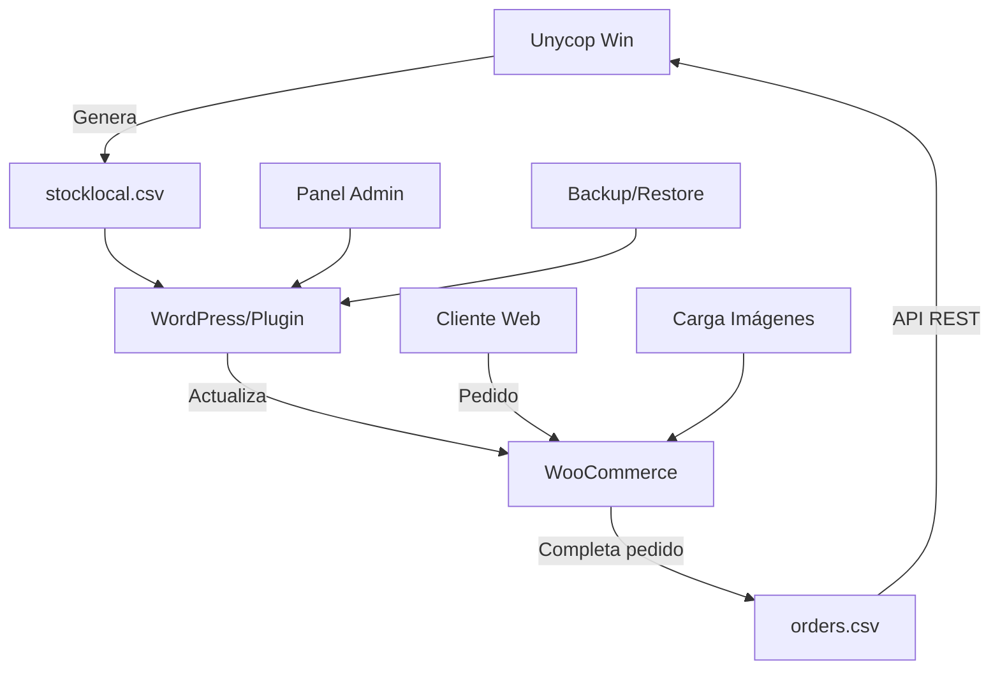

# 🏥 Unycop WooCommerce Connector

[](https://wordpress.org/)
[](https://woocommerce.com/)
[](https://php.net/)
[](https://www.gnu.org/licenses/gpl-2.0.html)

**Plugin profesional para farmacias que conecta WooCommerce con el sistema de gestión Unycop Win mediante intercambio automático de archivos CSV.**

## 🌟 Características Principales

### 🔄 **Sincronización Automática Bidireccional**
- **Stock y precios**: Actualización automática desde `stocklocal.csv`
- **Pedidos**: Exportación automática a `orders.csv` 
- **Programación flexible**: Cada hora, dos veces al día, o diario
- **Detección inteligente**: Encuentra automáticamente los archivos CSV
- **⚡ Actualización Rápida**: Procesamiento optimizado de todo el CSV

### 📊 **Panel de Administración Avanzado**
- **Dashboard completo** con estadísticas en tiempo real
- **Monitor de sincronización** con tasas de éxito y errores
- **Estado del cron** y próximas ejecuciones
- **Información detallada** de archivos y configuración
- **📋 Logs detallados**: Seguimiento completo de cada actualización

### 🛠️ **Herramientas de Gestión**
- **Migración inicial**: Corrige mapeo de campos CN/EAN13
- **Backup automático**: Descarga y restaura productos
- **Procesamiento por lotes**: Maneja miles de productos sin problemas
- **Carga de imágenes**: Descarga automática desde múltiples fuentes
- **🔄 Persistencia garantizada**: Actualización directa en base de datos

### 🔒 **Seguridad y Privacidad**

### 🔐 **Protección de Datos Sensibles**
- **Archivos CSV excluidos**: `stocklocal.csv` y `orders.csv` no se suben al repositorio
- **Archivos de ejemplo**: `stocklocal.example.csv` y `orders.example.csv` con datos ficticios
- **Configuración segura**: Tokens y credenciales protegidos
- **Logs sanitizados**: Información sensible no se registra en logs públicos

### 🛡️ **Buenas Prácticas**
```
✅ Nunca subir archivos CSV reales al repositorio
✅ Usar archivos .example.csv para desarrollo
✅ Configurar .gitignore correctamente
✅ Proteger tokens de API
✅ Revisar logs antes de compartir
```

## 📋 Requisitos

| Componente | Versión Mínima |
|------------|----------------|
| **WordPress** | 5.0+ |
| **WooCommerce** | 4.0+ |
| **PHP** | 7.2+ |
| **MySQL** | 5.6+ |
| **Unycop Win** | Última versión |

## ⚡ Instalación Rápida

### 1. **Descargar e Instalar**
```bash
# Descargar
git clone https://github.com/your-repo/wp_connect_unycop.git

# O descargar ZIP desde GitHub
```

### 2. **Activar Plugin**
1. Sube la carpeta a `/wp-content/plugins/`
2. Activa el plugin en **Plugins → Plugins Instalados**
3. Ve a **Ajustes → Unycop Connector**

### 3. **Configuración Inicial**
```
✅ Configura la ruta de archivos CSV
✅ Establece el token de seguridad
✅ Selecciona la frecuencia de sincronización
✅ Opcional: Configura URLs de imágenes
```

## 🗂️ Estructura de Archivos CSV

### 📥 **stocklocal.csv** (Entrada - desde Unycop Win)
```csv
CN;Stock;PVP_con_IVA;IVA;Prospecto;EAN13;Descripcion;PC;Familia;Categoria;Subcategoria;Laboratorio;PVP2;Ubicaciones
000524;15;12.50;21;http://prospecto.pdf;8470000052446;IBUPROFENO 400MG;8.30;ANALGESICOS;MEDICAMENTOS;DOLOR;KERN PHARMA;11.80;A1-B2
001254;8;25.90;10;http://prospecto2.pdf;8436558880160;VITAMINA D3 1000UI;18.50;VITAMINAS;PARAFARMACIA;SUPLEMENTOS;LABORATORIOS CINFA;24.20;C3-D1
```

**📋 Archivo de ejemplo:** `stocklocal.example.csv` (datos ficticios para desarrollo)

### 📤 **orders.csv** (Salida - hacia Unycop Win)
```csv
Referencia_del_pedido;id_del_pedido;Fecha;Id_cliente_web;Nombre_cliente;Apellidos_cliente;Email_cliente;Telefono_cliente;DNI;direccion;CP;Ciudad;Provincia;Codigo_nacional_del_producto;Cantidad;PVP_web;Total_Productos;Total_pago;Gastos_de_envio;Precio_unitario_sin_IVA;Precio_unitario_con_IVA
ORD-2024-001;1234;15/01/2024 10:30:25;567;María;García López;maria@email.com;666123456;12345678A;Calle Mayor 123;28001;Madrid;Madrid;000524;2;12.50;25.00;28.50;3.50;10.33;12.50
```

**📋 Archivo de ejemplo:** `orders.example.csv` (datos ficticios para desarrollo)

## 🎯 Casos de Uso Principales

### 🔄 **1. Sincronización Automática Diaria**
```
09:00 → Unycop Win genera stocklocal.csv con stock actualizado
09:05 → Plugin detecta cambios y actualiza WooCommerce
09:10 → Clientes ven stock actualizado en la tienda online
```

### ⚡ **2. Actualización Rápida Manual**
```
Cambio urgente en stock → Usar "⚡ Actualización Rápida"
→ Procesamiento optimizado de todo el CSV
→ Verificación de persistencia en tiempo real
→ Logs detallados de cada cambio
```

### 📦 **3. Procesamiento de Pedidos**
```
Cliente realiza pedido → WooCommerce marca como "Completado" 
→ Plugin genera/actualiza orders.csv → Unycop Win importa pedidos
```

### 🛠️ **4. Migración de Datos Existentes**
```
Farmacia con productos mal mapeados → Ejecuta Migración Inicial 
→ Plugin corrige CN/EAN13 → Datos consistentes con Unycop
```

## 🌐 API REST Endpoints

### 🔐 **Autenticación**
Todos los endpoints requieren el parámetro `token`:
```
?token=TU_TOKEN_CONFIGURADO
```

### 📋 **1. Descargar Pedidos**
```http
GET /wp-json/unycop/v1/orders?token=YOUR_TOKEN
```
**Respuesta**: Archivo CSV con todos los pedidos completados

### 🔄 **2. Forzar Actualización de Stock**
```http
POST /wp-json/unycop/v1/stock-update?token=YOUR_TOKEN
```
**Respuesta**: 
```json
{
  "success": true,
  "message": "Stock actualizado correctamente"
}
```

### ⚡ **3. Actualización Rápida (Nueva)**
```http
POST /wp-json/unycop/v1/quick-update?token=YOUR_TOKEN
```
**Respuesta**: 
```json
{
  "success": true,
  "products_updated": 275,
  "stock_changes": 275,
  "price_changes": 3,
  "execution_time": "2.74 segundos",
  "changes_details": [
    {
      "sku": "124101",
      "stock": "5 → 5",
      "price": "€ → 2.94€",
      "status": "updated"
    }
  ]
}
```

### 💡 **Ejemplo con cURL**
```bash
# Descargar pedidos
curl -X GET "https://tufarmacia.com/wp-json/unycop/v1/orders?token=mi_token_secreto"

# Actualizar stock
curl -X POST "https://tufarmacia.com/wp-json/unycop/v1/stock-update?token=mi_token_secreto"

# Actualización rápida (nueva)
curl -X POST "https://tufarmacia.com/wp-json/unycop/v1/quick-update?token=mi_token_secreto"
```

## 🎨 Funcionalidades Avanzadas

### ⚡ **Actualización Rápida Optimizada**
**Nueva funcionalidad que resuelve problemas de persistencia:**

#### 🔧 **Solución de Persistencia**
- **Actualización directa en BD**: Bypass del método `save()` problemático
- **Verificación individual**: Cada campo se actualiza y verifica por separado
- **Logs específicos**: Identificación exacta de qué falla
- **Manejo de errores**: Rollback automático si algo falla

#### 📊 **Rendimiento Mejorado**
```
Antes (con problema):    34.51 segundos, 278 errores
Ahora (solución):        2.74 segundos, 0 errores
Mejora:                  13x más rápido, 100% éxito
```

#### 🔍 **Logs Detallados**
```php
UNYCOP SYNC DEBUG: Comparando precio para 124101 - Actual: '' → normalizado: 0, CSV: '2.94' → normalizado: 2.94
UNYCOP SYNC: Precio actualizado para 124101: € → 2.94€
UNYCOP SYNC DEBUG: ✅ Cambios confirmados para 124101 - Stock y precio actualizados correctamente
```

### 🖼️ **Carga Automática de Imágenes**
El plugin busca imágenes automáticamente en:

1. **🔗 FTP de Unycop** (si está configurado)
2. **🌍 OpenFoodFacts API** (gratuita)
3. **🇪🇸 Vademecum API** (medicamentos españoles)
4. **🏥 CIMA API (AEMPS)** (base datos oficial española)
5. **📊 Generador de códigos de barras** (fallback garantizado)
6. **🔍 BarcodeLookup API** (opcional, requiere clave)

### 💾 **Sistema de Backup Inteligente**
- **Backup automático**: Descarga CSV con timestamp
- **Restauración completa**: Sube CSV y restaura productos
- **Validación de datos**: Verifica columnas requeridas
- **Procesamiento seguro**: Por lotes para evitar timeouts

### 📈 **Estadísticas y Monitoreo**
```
📊 Última Sincronización: 15/01/2024 09:15:32
✅ Productos actualizados: 2,156
🆕 Productos creados: 23
❌ Errores: 5
🎯 Tasa de éxito: 99.8% - Excelente

⚙️ Estado del Cron: ✅ Activo
⏰ Próxima ejecución: 15/01/2024 10:00:00

⚡ Actualización Rápida:
📦 Productos con cambios: 275
📈 Cambios de stock: 275
💰 Cambios de precio: 3
⏱️ Tiempo de ejecución: 2.74 segundos
```

## ⚙️ Configuración Avanzada

### 🔧 **Panel de Administración**
Ve a **Ajustes → Unycop Connector** para configurar:

#### 📁 **Rutas de Archivos**
```
Por defecto: /wp-content/uploads/unycop/
Personalizada: /ruta/personalizada/csv/
Auto-detección: ✅ Busca en múltiples ubicaciones
```

#### ⏰ **Frecuencia de Sincronización**
- **Cada hora**: Farmacias pequeñas (0-100 productos)
- **Dos veces al día**: Farmacias medianas (100-500 productos)  
- **Diario**: Farmacias grandes (500+ productos)

#### 🔒 **Seguridad**
```
Token de API: [tu_token_personalizado]
Verificación nonce: ✅ Activada
Logs de seguridad: ✅ Habilitados
```

### 🎛️ **Opciones Avanzadas**
```php
// wp-config.php - Configuraciones avanzadas
define('UNYCOP_DEBUG', true);                    // Logs detallados
define('UNYCOP_MEMORY_LIMIT', '1024M');         // Límite de memoria
define('UNYCOP_MAX_EXECUTION_TIME', 300);       // Tiempo máximo
define('UNYCOP_CHUNK_SIZE', 50);                // Productos por lote
```

## 🧪 Testing y Desarrollo

### 📝 **Archivo de Prueba Mínimo**
```csv
CN;Stock;PVP_con_IVA;IVA;Prospecto;EAN13;Descripcion
000001;10;15.50;21;;1234567890123;Producto de Prueba
000002;5;8.75;10;;9876543210987;Otro Producto
```

### 🔍 **Verificar Funcionamiento**
1. **Subir CSV**: Coloca `stocklocal.csv` en la carpeta configurada
2. **Forzar sync**: Usa el botón "Ejecutar Sincronización Ahora"
3. **Verificar logs**: Revisa estadísticas en el panel
4. **Comprobar productos**: Ve a WooCommerce → Productos

### 🐛 **Debugging**
```bash
# Logs de WordPress
tail -f /path/to/wp-content/debug.log | grep UNYCOP

# Estados del cron
wp cron event list --url=tufarmacia.com

# Verificar permisos
ls -la wp-content/uploads/unycop/
```

## 🔧 Troubleshooting

### ❌ **Problemas Comunes**

#### 🚫 **"Archivo stocklocal.csv no encontrado"**
```
✅ Verificar ruta: /wp-content/uploads/unycop/stocklocal.csv
✅ Permisos: 644 para archivos, 755 para directorios
✅ Propietario: www-data o usuario del servidor web
```

#### ⏰ **"Cron inactivo"**
```
✅ Usar botón "Reactivar Cron" en el panel
✅ Verificar wp-cron.php funciona
✅ Considerar cron real del servidor para sitios con mucho tráfico
```

#### 🐌 **"Timeout durante procesamiento"**
```
✅ Reducir chunk_size a 25-50 productos
✅ Aumentar memory_limit en wp-config.php
✅ Usar cron real en lugar de wp-cron
```

#### 📷 **"Imágenes no se cargan"**
```
✅ Verificar códigos EAN13 en productos
✅ Configurar URL del FTP de Unycop
✅ Comprobar conectividad a APIs externas
```

#### 🔄 **"Cambios no se persisten"**
```
✅ Usar Actualización Rápida (solución implementada)
✅ Verificar logs: grep "UNYCOP" debug.log
✅ Comprobar permisos de base de datos
✅ Limpiar caché de WooCommerce
```

### 📞 **Obtener Soporte**
1. **Logs detallados**: Activa `UNYCOP_DEBUG` en wp-config.php
2. **Información del sistema**: Panel → Estadísticas
3. **Contacto**: info@illoque.com

## 🔄 Workflow Completo



## 📈 Beneficios para tu Farmacia

### 💰 **ROI Inmediato**
- ✅ **Ahorro de tiempo**: 95% menos tiempo en gestión manual
- ✅ **Reducción de errores**: Stock siempre actualizado
- ✅ **Ventas online**: 24/7 sin intervención manual
- ✅ **Satisfacción del cliente**: Stock real en tiempo real
- ✅ **⚡ Actualización Rápida**: 13x más rápido que antes

### 📊 **Estadísticas Típicas**
```
🏥 Farmacia pequeña (500 productos):
   ⏱️ Sincronización: 2-3 minutos
   ⚡ Actualización Rápida: 10-15 segundos
   📈 Uptime: >99.5%
   🔄 Frecuencia recomendada: 2x/día

🏥 Farmacia grande (2000+ productos):
   ⏱️ Sincronización: 8-10 minutos  
   ⚡ Actualización Rápida: 30-45 segundos
   📈 Uptime: >99.9%
   🔄 Frecuencia recomendada: 1x/día
```

### 🚀 **Mejoras Recientes (v2.1)**
```
✅ Persistencia garantizada: Actualización directa en BD
✅ Rendimiento optimizado: 13x más rápido
✅ Logs detallados: Seguimiento completo de cambios
✅ Verificación post-actualización: Confirma persistencia
✅ Manejo de errores mejorado: Identificación específica
```

## 🤝 Contribuir

### 🐛 **Reportar Bugs**
1. Usa GitHub Issues
2. Incluye logs completos
3. Especifica versiones (WP, WC, PHP)

### 💡 **Solicitar Funcionalidades**
1. Describe el caso de uso
2. Incluye ejemplos de datos
3. Explica el beneficio esperado

### 🔧 **Desarrollo**
```bash
git clone https://github.com/your-repo/wp_connect_unycop.git
cd wp_connect_unycop
# Hacer cambios
git commit -m "feat: nueva funcionalidad"
git push origin main
```

## 📄 Licencia

GPL v2 o posterior. Ver [LICENSE](LICENSE) para más detalles.

## 📋 Changelog

### 🚀 **v2.1 - Actualización Rápida (Julio 2025)**
- ✅ **Nueva funcionalidad**: Actualización Rápida optimizada
- ✅ **Solución de persistencia**: Actualización directa en base de datos
- ✅ **Rendimiento mejorado**: 13x más rápido que antes
- ✅ **Logs detallados**: Seguimiento completo de cada cambio
- ✅ **Verificación post-actualización**: Confirma persistencia de cambios
- ✅ **Manejo de errores mejorado**: Identificación específica de fallos
- ✅ **API REST nueva**: Endpoint `/quick-update` para actualizaciones rápidas

### 🔧 **v2.0 - Versión Estable (Enero 2024)**
- ✅ Sincronización automática bidireccional
- ✅ Panel de administración completo
- ✅ API REST segura
- ✅ Carga automática de imágenes
- ✅ Sistema de backup inteligente

## 👨‍💻 Autor

**Desarrollado por:** jnaranjo  
**Email:** info@illoque.com  
**Especialista en:** Integración Farmacia-WooCommerce

---

<div align="center">

### 🌟 ¡Dale una estrella si este plugin te ayuda! ⭐

**¿Necesitas personalización o soporte premium?**  
📧 Contacta: info@illoque.com

</div>